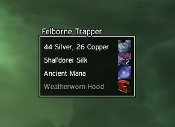

Butsu is a small replacement for the default loot frame. It supports showing more than four items, and has a slick look.

You can move the frame by holding down <Alt> and clicking on the title.

This is a [fork](https://github.com/haste/Butsu) from the original by haste found [here](https://www.wowinterface.com/downloads/info7976-Butsu.html).

**Changes** from original: 
  - Border texture.